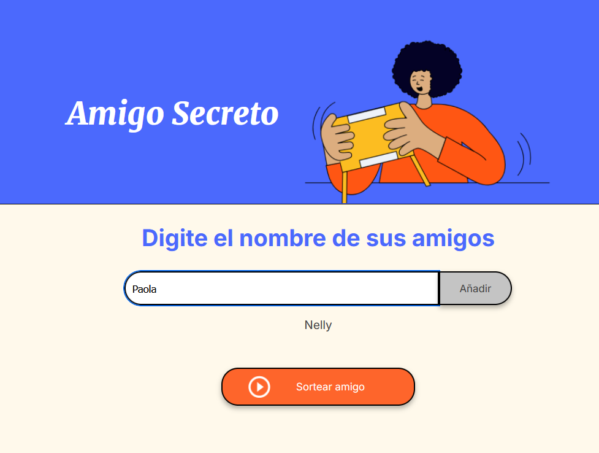
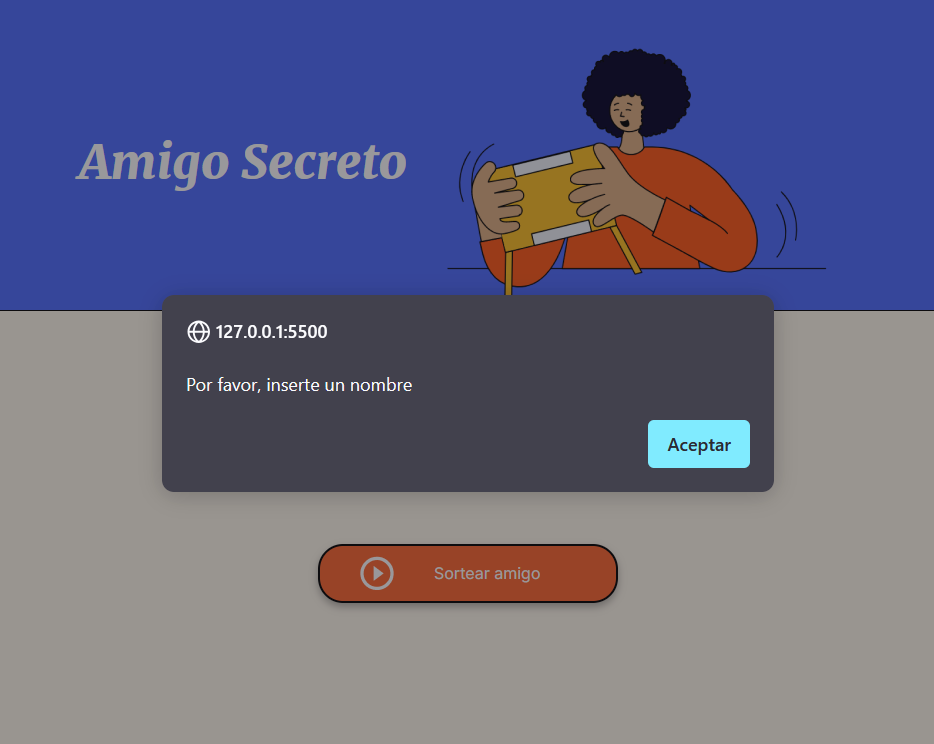
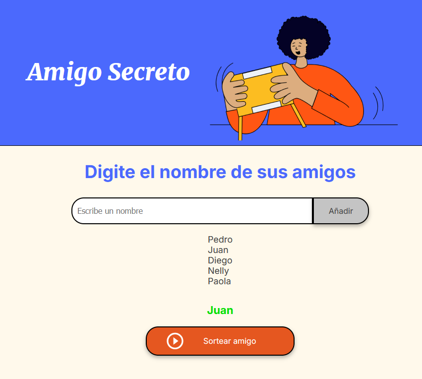

# Challenge Alura - Amigo Secreto

Este desafío consiste en una aplicación que permite a un usuario ingresar nombres en una lista. Posteriormente, la aplicación realiza un sorteo aleatorio estableciendo una relación de amigo secreto entre los nombres ingresados.

## Funcionalidades ⚙️

- ✍️**Agregar nombres:** Los usuarios pueden ingresar nombres en un campo de texto y hacer clic en **"Añadir"** para agregarlos a la lista.
  
  

- ❗**Validación de entrada:** Si el campo de texto está vacío o contiene caracteres no válidos, el sistema mostrará una alerta solicitando un nombre válido.
  
  

- 👀**Visualización dinámica:** Los nombres ingresados aparecerán en una lista actualizada automáticamente debajo del campo de entrada.
  
  

- 🎲**Sorteo aleatorio:** Al hacer clic en el botón **"Sortear Amigo"**, el sistema seleccionará aleatoriamente un nombre de la lista y lo mostrará en pantalla.
  
  

## Instalación y Uso 🛠️

1. Clona este repositorio:
   ```sh
   git clone https://github.com/Mauro1893/challenge-amigo-secreto.git
2. Accede a directorio del proyecto 

cd challenge-amigo-secreto

3. Abre index.html en tu navegador para ver la aplicación en funcionamiento


#Estructura del Proyecto 📂

challenge-amigo-secreto/

│

├── assets/

│   └── readme/

│       ├── funcion1.png

│       ├── funcion2.png

│       ├── funcion3.png

│       └── funcion4.png

│

├── index.html

├── styles.css

└── script.js

#Licencia 📜 

Este proyecto está licenciado bajo la Licencia MIT. Consulta el archivo LICENSE para obtener más detalles.
Con estos cambios, tu README será más completo y útil tanto para usuarios como para desarrolladores que quieran contribuir.
